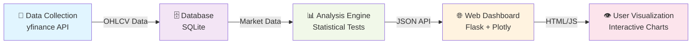
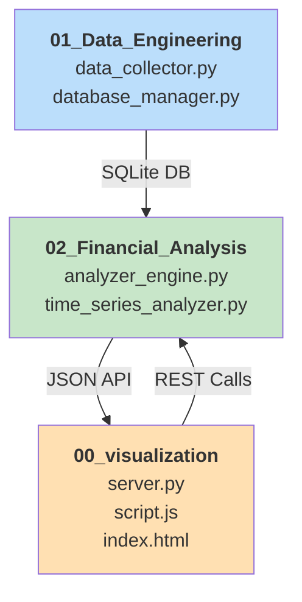
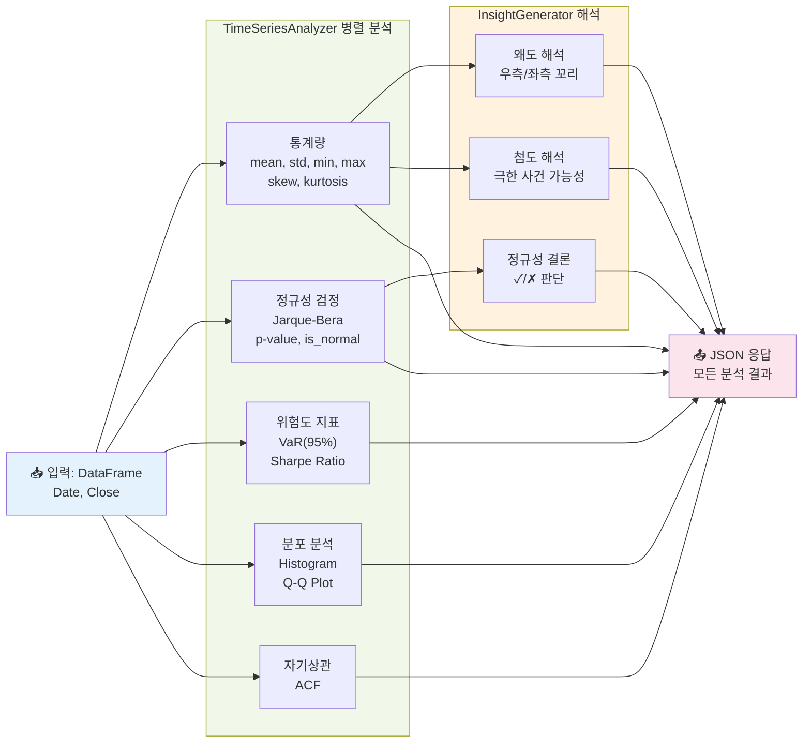

# Quant-Finance-Lab: 체계적인 퀀트 금융 리서치 및 구현 포트폴리오
**금융공학 및 계산금융 이론 구현 프로젝트**

---

## 0. Project Architecture



### 📋 데이터 흐름
1. **데이터 수집** (`data_collector.py`) → yfinance API에서 OHLCV 다운로드
2. **DB 저장** (`database_manager.py`) → SQLite에 적재
3. **분석 엔진** (`analyzer_engine.py`) → Jarque-Bera 검정, 통계 계산
4. **API 서버** (`server.py`) → Flask로 JSON 응답
5. **시각화** (`script.js`) → Plotly 인터랙티브 차트

---

## 1. Project Overview
**Quant-Finance-Lab**은 Python을 활용하여 핵심적인 퀀트 금융 이론을 'From Scratch' 방식으로 직접 구현하고, 실제 데이터를 통해 검증하는 체계적인 리서치 프로젝트입니다. 본 프로젝트는 **수학적 이론**(확률 미적분, 선형대수)과 **실용적 구현**(데이터 파이프라인, 백테스팅) 사이의 간극을 연결하는 능력을 보여주는 것을 목표로 합니다.

*   **목표:** 금융 이론을 실제 데이터와 결합하여 검증함으로써, 금융공학 석사(MFE) 수준의 깊이 있는 포트폴리오를 구축합니다.
*   **주요 중점 분야:**
    1.  **데이터 엔지니어링:** 금융 시계열 데이터 수집 및 정제를 위한 자동화된 ETL 파이프라인 구축.
    2.  **계량경제학:** 수익률, 변동성 등 통계적 특성 분석 및 정규성 검정.
    3.  **자산 가격결정:** CAPM, Fama-French 팩터 모델 등 주요 가격결정 모델 구현.
    4.  **파생상품:** 블랙숄즈 모형 및 몬테카를로 시뮬레이션을 통한 옵션 가격 결정.

## 2. Repository Structure

본 프로젝트는 금융공학 석사 과정의 커리큘럼을 참고하여, 이론 학습부터 실제 구현까지의 과정을 순차적으로 경험할 수 있도록 모듈화되었습니다.

### 모듈 간 의존성


### 디렉토리 구조
```plaintext
Quant-Finance-Lab/
│
├── 00_visualization/       # 🌐 웹 기반 대시보드
│   ├── server.py           # Flask 백엔드 (TimeSeriesAnalyzer 호출)
│   ├── index.html          # 메인 HTML
│   ├── style.css           # 컴팩트 레이아웃 스타일
│   ├── script.js           # Plotly 차트 및 API 호출
│   └── README.md           # 대시보드 사용 설명서
│
├── 01_Data_Engineering/    # 📡 데이터 파이프라인
│   ├── data_collector.py   # yfinance → CSV/DB
│   ├── database_manager.py # SQLite 핸들러 (Context Manager)
│   └── market_data.db      # OHLCV 시계열 데이터베이스
│
├── 02_Financial_Analysis/  # 📊 분석 엔진
│   ├── analyzer_engine.py          # TimeSeriesAnalyzer + InsightGenerator
│   ├── time_series_analyzer.py     # 로컬 테스트용 시각화
│   └── __init__.py                 # 패키지 모듈
│
├── 03_Asset_Pricing/       # (계획중) CAPM, Fama-French
├── 04_Portfolio_Mgmt/      # (계획중) 마코위츠 포트폴리오
├── 05_Derivatives/         # (계획중) Black-Scholes, Monte Carlo
├── 06_Paper_Replication/   # (계획중) 학술 논문 구현
│
└── README.md               # 이 파일
```

## 3. Tech Stack & Tools

* **Language:** Python 3.9+
* **Backend:** Flask, Flask-CORS
* **Data Handling:** pandas, numpy, sqlite3, yfinance
* **Statistical Analysis:** scipy.stats, statsmodels
* **Frontend:** HTML5, CSS3, JavaScript (ES6+)
* **Visualization:** Plotly.js (웹 인터랙티브 차트)
* **Documentation:** LaTeX, Markdown

---

## 4. Analysis Engine Architecture

분석 엔진(`analyzer_engine.py`)은 다음과 같이 병렬 처리로 각 종목을 분석합니다:



### 공동 처리 로직
- 모든 분석이 **단 하나의 DataFrame**에서 수행
- 중복 계산 제거 (통계량 → 해석)
- 웹/로컬 모두 동일한 엔진 사용

---

## 5. Curriculum & Progress

### Phase 1: 금융 데이터 인프라 구축 [완료]
*데이터 무결성을 보장하는 견고한 금융 데이터 파이프라인 구축.*
- [x] **데이터 수집 자동화:** `yfinance` API를 활용하여 OHLCV 데이터 크롤링 및 적재 자동화 (`data_collector.py`).
- [x] **데이터베이스 구축:** 수집된 시계열 데이터를 SQLite DB에 저장하여 체계적으로 관리 (`market_data.db`).
- [x] **데이터 정제:** 결측치 처리 및 수정종가(Adjusted Close) 기준 데이터 클렌징 수행.

### Phase 2: 계량경제학 및 팩터 모델링 [진행 중]
*자산 수익률의 통계적 특성 분석 및 초과 수익(Alpha) 분해.*
- [x] **웹 기반 시계열 분석 대시보드:** Flask 백엔드 + HTML/CSS/JavaScript 프론트엔드 구축
  - SQLite DB에서 직접 데이터 읽음 (data.json 제거)
  - 동적 UI: 새 종목 추가 시 자동 반영
  - Plotly.js를 이용한 인터랙티브 차트 4종류 (가격, 수익률 분포, Q-Q Plot, ACF)
  - RESTful API: `/api/data`, `/api/ticker/<ticker>`
- [x] **시계열 분석:** Q-Q 플롯을 통한 정규성 검정, 자기상관(ACF) 분석
- [x] **통계 지표:** 평균, 변동성, 왜도, 첨도 등 수익률 특성 분석
  - Jarque-Bera 정규성 검정 (p-value 기반 판단)
  - 왜도(Skewness) 자동 해석: 극단 수익률 방향 분석
  - 첨도(Kurtosis) 자동 해석: 극한 사건 발생 확률 평가
  - 위험도 지표: 95% VaR (일일 손실 확률), Sharpe Ratio (위험조정 수익률)
- [ ] **팩터 모델링:** `statsmodels`를 이용한 Fama-French 3-Factor 모델 구현 및 회귀분석
- [ ] **백테스팅:** PER, PBR 등 기본적(Fundamental) 팩터를 기반으로 한 투자 전략 수립 및 성과 검증

### Phase 3: Portfolio Optimization
*자산 배분 및 리스크 관리를 위한 계량적 접근.*
- [ ] **효율적 투자선 (Efficient Frontier):** 위험-수익률 상충 관계(Trade-off) 시각화.
- [ ] **최적화 기법:** `scipy.optimize`를 활용하여 최소분산포트폴리오(MVP) 등 최적 포트폴리오 탐색.
- [ ] **블랙-리터만 모델:** 시장 균형에 투자자의 주관적 견해를 결합하는 모델 구현.

### Phase 4: 파생상품 및 계산금융
*수치적 기법을 활용한 복합 금융상품 가격결정.*
- [ ] **블랙-숄즈 방정식:** 유럽형 옵션의 해석적 해(Analytical Solution) 도출 및 민감도(Greeks) 지표 시각화.
- [ ] **몬테카를로 시뮬레이션:** 기하 브라운 운동(GBM)을 가정한 경로 의존형 옵션(Path-Dependent Options) 가격 결정.
- [ ] **이항 트리 모델:** 미국형 옵션(American Options) 가격 결정 모델 구현.

### Phase 5: 논문 재현
*주요 금융 연구 논문 구현 및 분석.*
- [ ] **논문 선정 및 구현:** "Momentum Crash", "Machine Learning in Asset Pricing" 등 최신 금융공학 논문 재현.

---

## 6. Getting Started

### 설치 및 실행

#### 1. 필수 패키지 설치
```bash
pip install flask flask-cors pandas numpy scipy statsmodels yfinance
```

#### 2. 데이터 수집 (최초 1회)
```bash
cd 01_Data_Engineering
python data_collector.py
```
이 스크립트는 AAPL, MSFT, TSLA, SPY의 2020-2023 데이터를 다운로드하여 `market_data.db`에 저장합니다.

#### 3. 웹 대시보드 실행
```bash
cd 00_visualization
python server.py
```
브라우저에서 `http://127.0.0.1:8000` 접속

### 웹 대시보드 기능

- **4종류 인터랙티브 차트**
  - 가격 추이 (Area Chart)
  - 일일 수익률 분포 (Histogram)
  - 정규성 검정 (Q-Q Plot with Reference Line)
  - 자기상관 분석 (ACF with 95% Confidence Interval)

- **통계 정보** (실시간 계산)
  - 평균 수익률, 변동성, 최소/최대값
  - 왜도(Skewness), 첨도(Kurtosis)

- **의미있는 통계 인사이트** ⭐ **[NEW]**
  - **Jarque-Bera 정규성 검정**: p-value 기반으로 "정규분포 여부" 판단
  - **왜도 해석**: "우측 꼬리" vs "좌측 꼬리" → 극단값 방향 분석
  - **첨도 해석**: "뚱뚱한 꼬리" vs "가는 꼬리" → 극한 사건 위험도 평가
  - **위험도 지표**: 95% VaR (일일 최대 손실 확률), Sharpe Ratio (수익률 대비 위험도)

- **동적 종목 추가**
  - `data_collector.py`에서 새 종목 추가 시 자동 반영
  - 종목별로 모든 데이터가 한 페이지에 표시

### API 엔드포인트

| Endpoint | 설명 | 응답 |
|----------|------|------|
| `GET /api/data` | 모든 종목 데이터 조회 | 전체 tickers의 통계 및 차트 데이터 |
| `GET /api/ticker/<ticker>` | 특정 종목 데이터 조회 | 특정 ticker의 상세 데이터 |
| `GET /` | 웹 대시보드 | index.html |

---

**Contact:** [trotz4210@gmail.com]